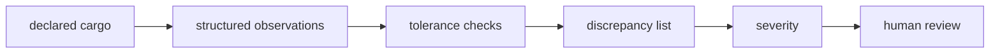

# Architecture

## Declaration
Structured shipment attributes form the expected state.

## Observation
Synthetic structured measurements represent what a future sensing stack might output.

## Comparator
Field-specific tolerances convert differences into discrepancies.

## Review gate
Any discrepancy currently requires review; future work can calibrate severity/risk thresholds.

## Design principle
Keep physical evidence comparison separate from the unbuilt perception stack so evaluation claims remain honest.
